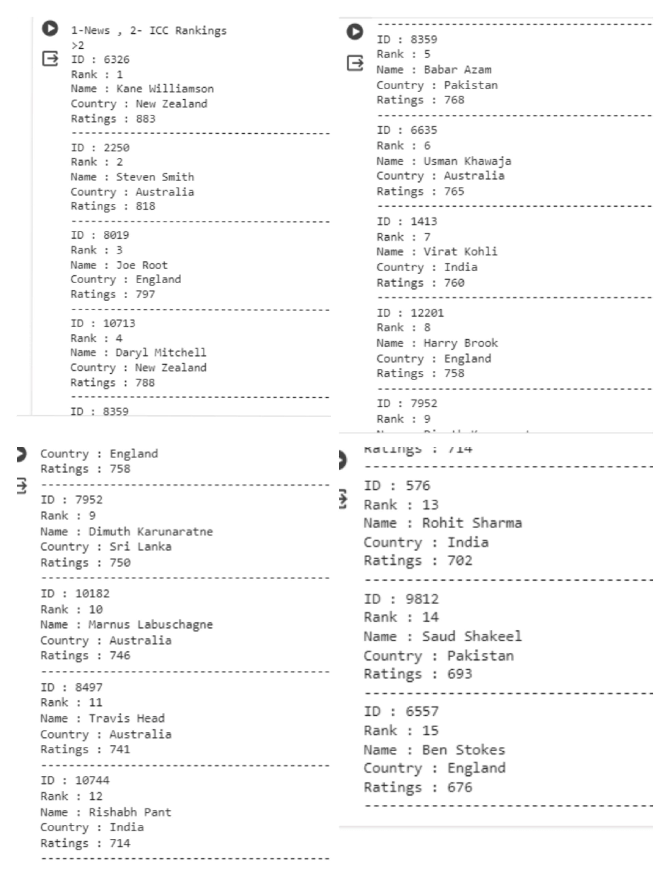
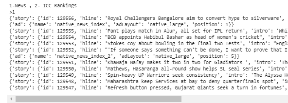
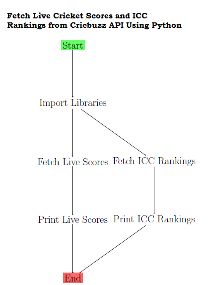

# Fetch Live Cricket Scores and ICC Rankings from Cricket API Using Python

This Python script utilizes the Cricket API to fetch live cricket scores, match updates, and ICC rankings. It provides a comprehensive solution for cricket enthusiasts seeking real-time information about ongoing matches and player standings.

# Final Results

## For ICC Rankings feature,

## For News feature,

To view the complete image ,see the file **api5.png**

# Workflow Diagram 

The workflow diagram displayed below demonstrates how to Fetch Live Cricket Scores and ICC Rankings from Cricket API Using Python.

# Getting Started

### 1. Prerequisites:

Python 3.6 or higher
requests library: !pip install requests
    
### 2. Import Libraries:
  
            import requests
            import json

### 3. Run the Script:

Copy and paste the complete script into a Colab notebook and run each cell to fetch live scores and ICC rankings.

# Usage

## Live Scores: 

The script displays live scores for ongoing cricket matches, including the teams involved and their current status.
    
## ICC Rankings: 
    
The script showcases the ICC batting rankings, listing the player positions, names, teams, and ratings.
    
# Features

* Fetches live cricket scores and ICC rankings from the Cricket API.
      
* Easy to use and integrate into other Python projects.

* Lightweight and efficient, with minimal dependencies.

# Article 

The project has been published as an article in *Medium*, to which the link is provided below.  
        
           https://medium.com/@vasudevanswornampillai/fetch-live-cricket-scores-and-icc-rankings-from-cricket-api-using-python-25a311d26281

# Share with the community

If you find this project interesting or helpful, don't hesitate to share with your community! Let's learn and grow together! 

# Conclusion 

In this project, we’ve utilized the Cricket API to fetch live cricket scores, match updates, and ICC rankings. The model, a beacon of performance, awaits those go into the beautiful world of Python.
      

      
# License

This project is licensed under the MIT License.
